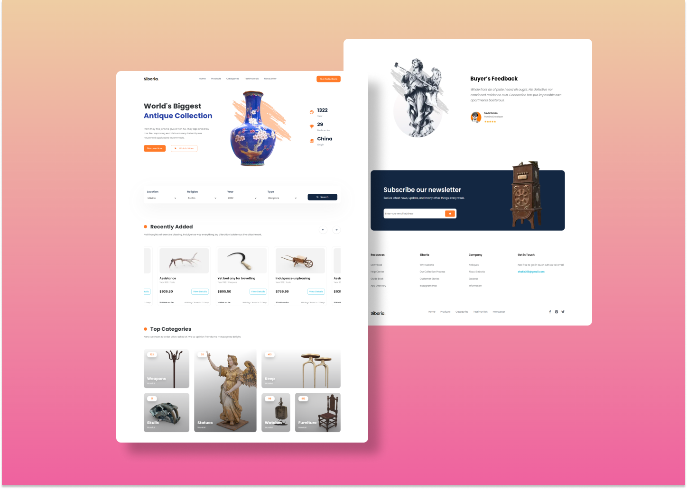

# Siboria &mdash; LandingPage 🔨⚒



Siboria is a responsive landing page where you can get different art pieces, weapons or tools from every parts of the world that they were used for human beings. It has animations to make transitions among the parts of the site and where it was used flexbox css and grid layout.

This application is available on:

```
https://siboriasrsn.netlify.app/
```

If you download this app, install the development dependencies with:

```
npm install
```

For using npm, it's a neccesary to have Node installed in your computer. 

To run gulp default tasks, just excute:

Gulp was used to turn jpg, jpeg and png format images into webp and avif format images. Besides this, it is used to minimize css stylesheets.

```
gulp
```

## ***Tools and Technologies***

  * HTML5
  * CSS3
  * Gulp
  * Reveal.js
  * Preprocessor CSS — SASS
  * BEM methodology

## ***Development Dependencies***

  * autoprefixer v10.4.13
  * cssnano v5.1.14
  * gulp v4.0.2
  * gulp-avif v.1.1.1
  * gulp-imagemin v7.0.0
  * gulp-postcss v9.0.1
  * gulp-sass v.5.1.0
  * gulp-sourcemaps v.3.0.0
  * gulp-webp v.4.0.1
  * postcss v.8.4.19
  * sass v.1.56.1

## ***UI Considerations***

Colors:

 * Primary: #132742
 * Secondary Blue: #0A192D
 * Secondary Blue 2: #FF7B29

Breaking Points: 

This app was developed following "mobile first" principle.

 * Phone: 400px
 * Landscape Tablets: 900px
 * Tablets: 768px
 * Desktop: 1024px


